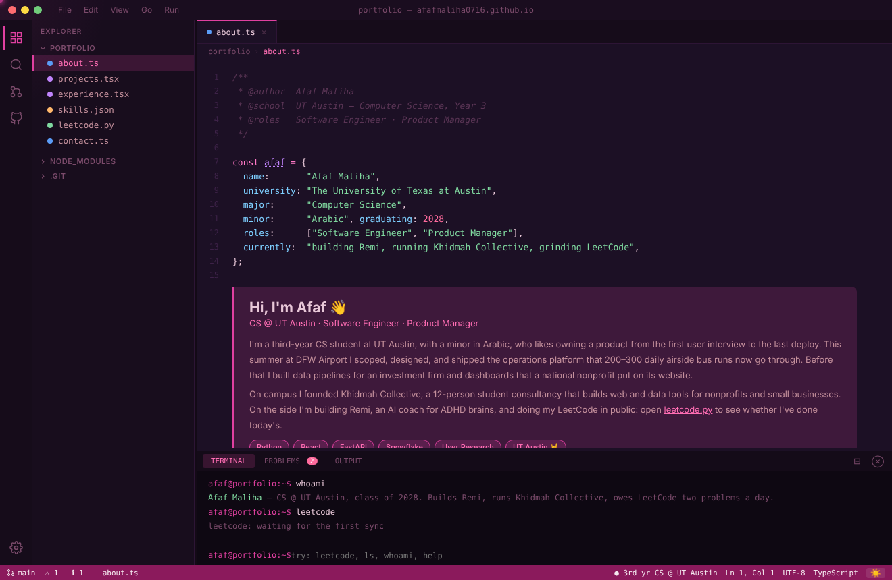

# afafmaliha0716.github.io

My portfolio, built to look and work like VS Code, in pink.

**[afafmaliha0716.github.io](https://afafmaliha0716.github.io)**



## What's in it

| File | Contents |
|------|----------|
| `about.ts` | Who I am and what I'm working on |
| `projects.tsx` | Remi, FocusDJ, Asteria, and this site |
| `experience.tsx` | Internships and Khidmah Collective |
| `skills.json` | Languages, frameworks, tools, product skills |
| `leetcode.py` | A live LeetCode tracker (see below) |
| `contact.ts` | Email, LinkedIn, GitHub |

## Things to try

- **Command palette:** `Ctrl+Shift+P` opens a fuzzy file search.
- **Keyboard shortcuts:** `Ctrl+1` through `Ctrl+6` jump between files.
- **Terminal:** type `help`, `ls`, `whoami`, `leetcode`, or `hook 'em`.
- **Theme:** the sun in the status bar switches between Night Pink and a
  light theme.
- **Panels:** drag the sidebar and terminal edges to resize them.
- There is one more thing, for people who remember old cheat codes.

## The LeetCode tracker

I'm doing interview prep in public. The rule is two problems a day, and the
site reports on it like a CI build:

- **Build passing** when I've solved two today, **unstable** at one, and
  **failing** at zero. The verdict shows in `leetcode.py`, in the status bar,
  in the Problems panel, and when you type `leetcode` in the terminal.
- Totals by difficulty, my current streak, a heatmap of the last 18 weeks,
  and the problems I solved most recently.

None of it is typed by hand. A GitHub Action
([`leetcode.yml`](.github/workflows/leetcode.yml)) runs every hour, calls
LeetCode's public GraphQL endpoint with
[`scripts/sync-leetcode.mjs`](scripts/sync-leetcode.mjs), and commits
`data/leetcode.json` when the numbers change. The page reads that file.

## How it's built

One `index.html` with plain HTML, CSS, and JavaScript. No frameworks, no build
step, no dependencies. GitHub Pages serves it straight from `main`.

To run it locally, serve the folder so the page can load the data file:

```bash
python3 -m http.server 3000
# then open http://localhost:3000
```

To run the sync script and its tests:

```bash
node --test scripts/sync-leetcode.test.mjs
node scripts/sync-leetcode.mjs afafMaliha0716
```
